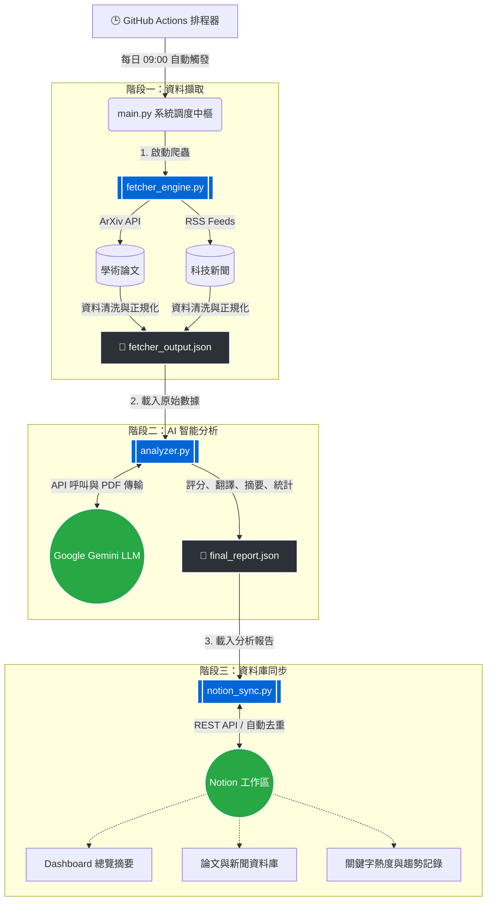

# 🤖 AI Research Agent (自動化學術研究與新聞分析系統)

此專案為全自動化的科技研究追蹤系統。每日自動抓取最新的 AI/ML 領域學術論文與科技新聞，交由 Google Gemini 進行深度分析與相關性評分，最後自動彙整並同步至 Notion 知識庫中。

## ✨ 核心功能

*   **自動抓取 (Fetcher Engine)**：從 ArXiv (學術論文) 與 RSS 來源自動收集過去 24 小時內的最新資訊。
*   **智能分析 (Analyzer)**：
    *   利用 Gemini API 對論文進行相關度評分 (0-10分)。
    *   自動下載高分論文的 PDF 進行深度解讀，提取核心貢獻與創新點。
    *   對科技新聞進行批次摘要，並統計熱門技術關鍵字 (如 LLM, RAG, XAI 等)。
*   **Notion 同步 (Notion Sync)**：將分析結果無縫寫入 Notion 的多個資料庫 (論文庫、新聞庫、關鍵字熱度、趨勢追蹤)，並支援自動去重機制。
*   **自動化排程**：透過 GitHub Actions 實現每日定時自動執行，無需人工介入。

---

## 📂 模組架構與檔案說明

本系統採用高度模組化設計，各核心檔案職責分明，確保資料處理流水線（Pipeline）的高效運行：

*   **`main.py`**
    *   **功能**：系統的啟動進入點。
    *   **職責**：負責依序調用資料抓取、AI 分析與資料庫同步模組。內建環境變數檢查機制（驗證金鑰及 ID 完整性）與錯誤中斷機制（若前置任務失敗則立即終止），並負責紀錄各階段之執行時間與系統日誌。

*   **`fetcher_engine.py`**
    *   **功能**：自動化資訊爬蟲與初步資料清洗。
    *   **職責**：利用 `arxiv` API 與 `feedparser` 套件，分別從學術資料庫與主流科技媒體 (RSS Feeds) 抓取過去 24 小時內之最新文獻與新聞。過濾無效資訊後，將標準化之數據輸出為 `fetcher_output.json`，供下游分析使用。

*   **`analyzer.py`**
    *   **功能**：串接大語言模型 (Google Gemini) 進行語意分析與內容摘要。
    *   **職責**：讀取初始數據並執行多層次分析：
        1.  **相關度評分**：依據預設之重點領域（如 LLM, RAG）對所有文獻進行 0-10 分之相關性評估。
        2.  **PDF 深度解析**：自動下載高分論文之 PDF 全文，交由 Gemini 提取核心貢獻、創新點並生成中文摘要。
        3.  **統計與翻譯**：對科技新聞進行批次翻譯與摘要，並透過正規表達式與 NLP 標籤提取當日熱門技術關鍵字。
        4.  分析結果統一編譯為 `final_report.json` 產出。

*   **`notion_sync.py`**
    *   **功能**：透過 Notion API 執行自動化排版與數據 Upsert (更新/寫入)。
    *   **職責**：利用 `httpx` 直接發送 API 請求以確保最高相容性。具備基於 URL 與標題之「自動去重機制」，將分析完畢的內容分發至 Dashboard 首頁、論文庫、新聞庫、關鍵字熱度與趨勢記錄等 5 個指定的 Notion 區塊與資料庫中。

*   **`requirements.txt`**
    *   **功能**：列出本專案運行所需之第三方 Python 函式庫，以確保開發環境與雲端部署環境之套件一致性。

*   **`.env`**
    *   **功能**：集中管理機密憑證（Credentials）。包含 API 金鑰與 Notion Database IDs。基於資訊安全規範。

*   **`.github/workflows/daily_agent.yml`**
    *   **功能**：定義 GitHub Actions 之自動化工作流。
    *   **職責**：設定每日定時排程，自動於雲端配置 Ubuntu 環境與 Python 3.12 執行環境、載入 GitHub Secrets，並自動執行 `main.py` 以達成完全無人值守之自動化運維。

### 🔄 系統運作流程圖

---

